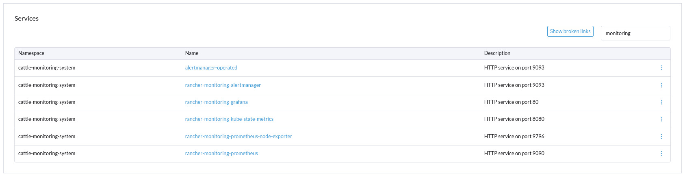

# rancher-services-ui-plugin
Kubernetes Services UI plugin for the Rancher Dashboard UI

This plugin analyzes all available Kubernetes services and provides all reachable HTTP/HTTPS services via Kubernetes Apiserver Proxy URLs (https://kubernetes.io/docs/tasks/access-application-cluster/access-cluster-services/) using the link in the table.

License
=======

Licensed under the Apache License, Version 2.0 (the "License");
you may not use this file except in compliance with the License.
You may obtain a copy of the License at

[http://www.apache.org/licenses/LICENSE-2.0](http://www.apache.org/licenses/LICENSE-2.0)

Unless required by applicable law or agreed to in writing, software
distributed under the License is distributed on an "AS IS" BASIS,
WITHOUT WARRANTIES OR CONDITIONS OF ANY KIND, either express or implied.
See the License for the specific language governing permissions and
limitations under the License.
